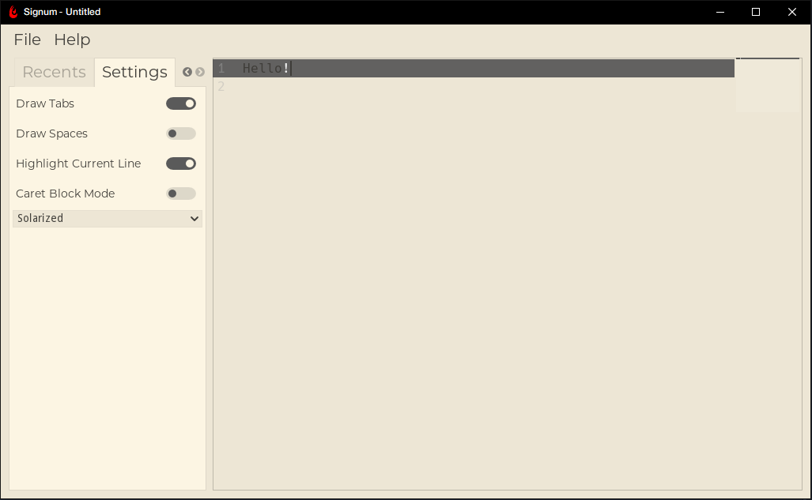

# Signum
text editor

Signum is a free and open source text editor, that is made with the Godot Engine! It uses the permissive MIT license, so anyone can contribute!

## Downloads
 - [GitHub Releases (Windows, Linux & Mac)](https://github.com/MintStudios/Signum/releases)
 
 _More download links pending_
 
 ## Contributing
 Please feel free to contribute, I am always looking for ways to improve the editor! Signum uses Godot version _**3.2.1**_
 
 1. Get the Godot Engine [here](https://godotengine.org/download/)
 2. Download this repo
 3. Make your own additions! **_MAKE SURE THAT YOU USE THE GLES2 RENDERER_**
